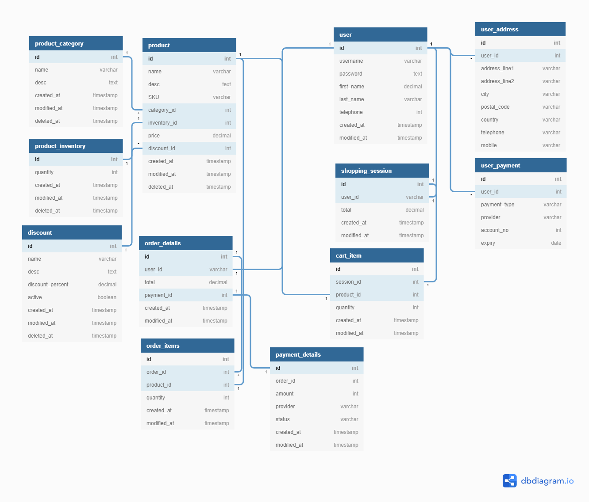

# E-Shop-Backend
Backend Node.js using mikrOrm/GraphQL/PostgreSQL stack


## Entity Relationship Model



## Install

```
npm install
npm install -g concurrently
npm install -g cross-env

```
## Development

```
npm run start:dev:local

```
